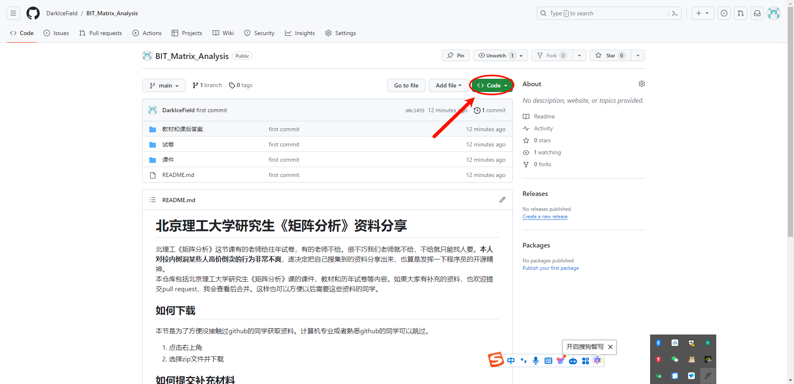
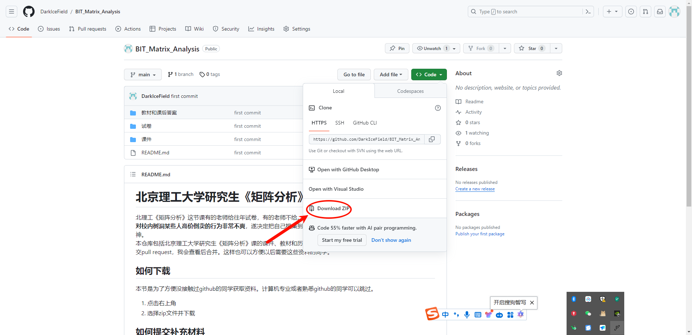

# 北京理工大学研究生《矩阵分析》资料分享
北理工《矩阵分析》这节课有的老师给往年试卷，有的老师不给。很不巧我们老师就不给，不给就只能找人要。**本人对校内树洞某些人高价倒卖的行为非常不爽**，遂决定把自己搜集到的资料分享出来，也算是发挥一下程序员的开源精神。  
本仓库包括北京理工大学研究生《矩阵分析》课的课件、教材和历年试卷等内容。如果大家有补充的资料，也欢迎提交pull request，我会查看后合并。这样也可以方便以后需要这些资料的同学。
## 如何下载

计算机专业或者熟悉github的同学可以跳过。
1. 点击右上角
   
2. 选择zip文件并下载
   

## 如何提交补充材料
### 方法一
通过我的联系方式联系我，我查看后会帮你上传到github。联系方式在最下方。
### 方法二
在github上提交pull request申请，具体步骤如下：
1. 下载git并安装，申请github账号 [CSDN教程](https://blog.csdn.net/m0_57787115/article/details/130296388?ops_request_misc=%257B%2522request%255Fid%2522%253A%2522170160797616800186572309%2522%252C%2522scm%2522%253A%252220140713.130102334..%2522%257D&request_id=170160797616800186572309&biz_id=0&utm_medium=distribute.pc_search_result.none-task-blog-2~all~top_positive~default-2-130296388-null-null.142^v96^control&utm_term=github%E4%BD%BF%E7%94%A8%E6%95%99%E7%A8%8B&spm=1018.2226.3001.4187)
2. fork本仓库，clone到本地，添加文件后再上传到远程仓库，提交pull request [CSDN教程](https://blog.csdn.net/CY2333333/article/details/113731490?ops_request_misc=%257B%2522request%255Fid%2522%253A%2522170162087916800211580270%2522%252C%2522scm%2522%253A%252220140713.130102334.pc%255Fall.%2522%257D&request_id=170162087916800211580270&biz_id=0&utm_medium=distribute.pc_search_result.none-task-blog-2~all~first_rank_ecpm_v1~rank_v31_ecpm-4-113731490-null-null.142^v96^control&utm_term=github%20pull%20request%E8%AF%A6%E7%BB%86%E6%95%99%E7%A8%8B&spm=1018.2226.3001.4187)  
## 联系方式
   邮箱 3120230955@bit.edu.cn
